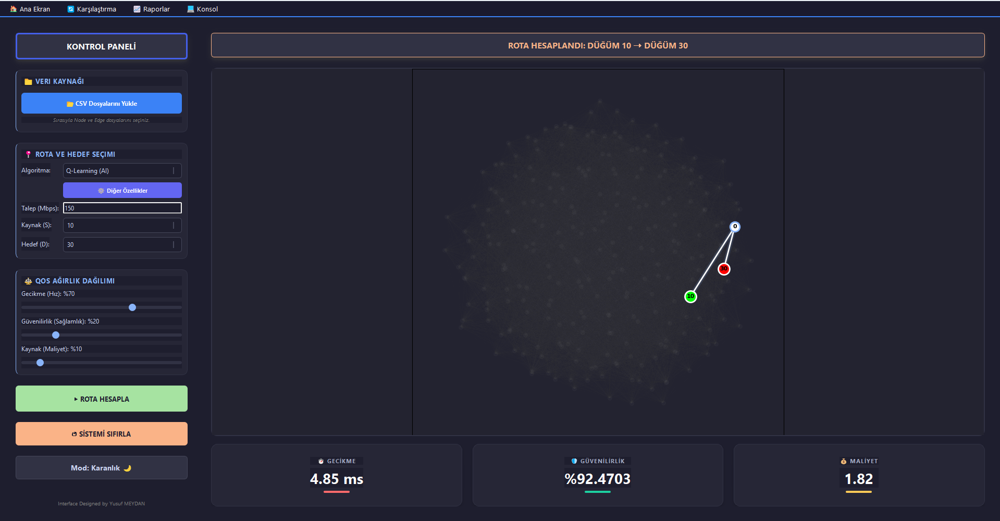
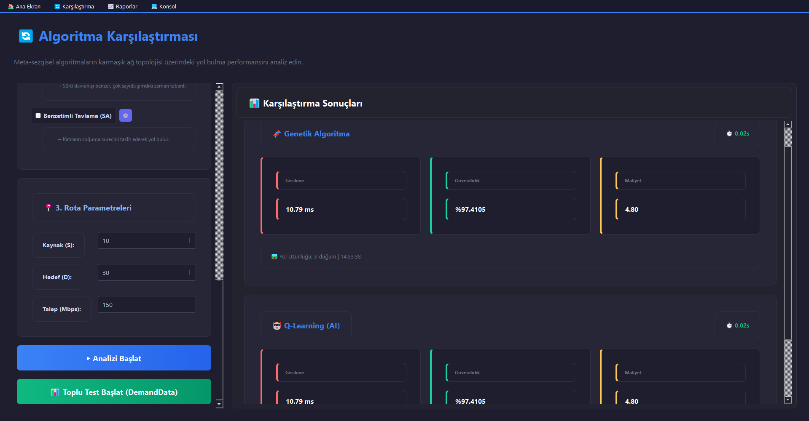
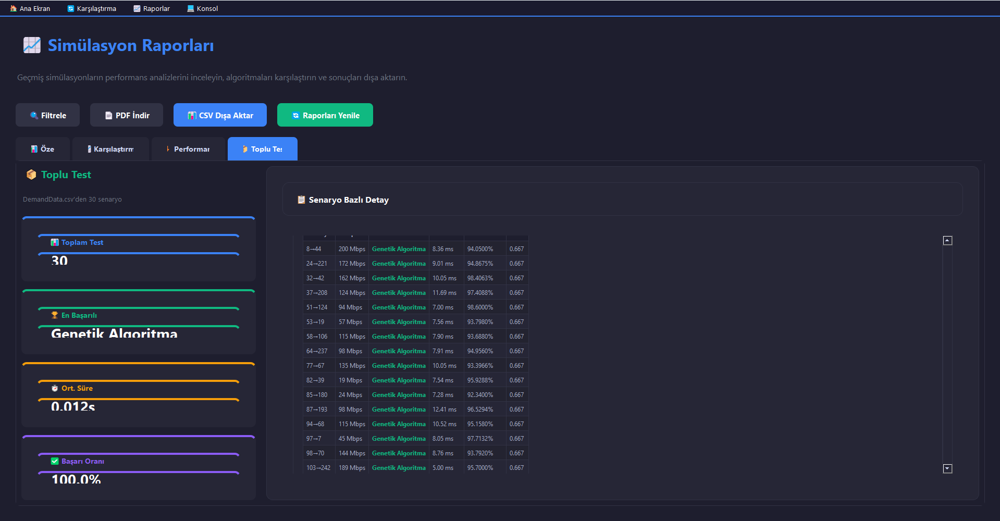
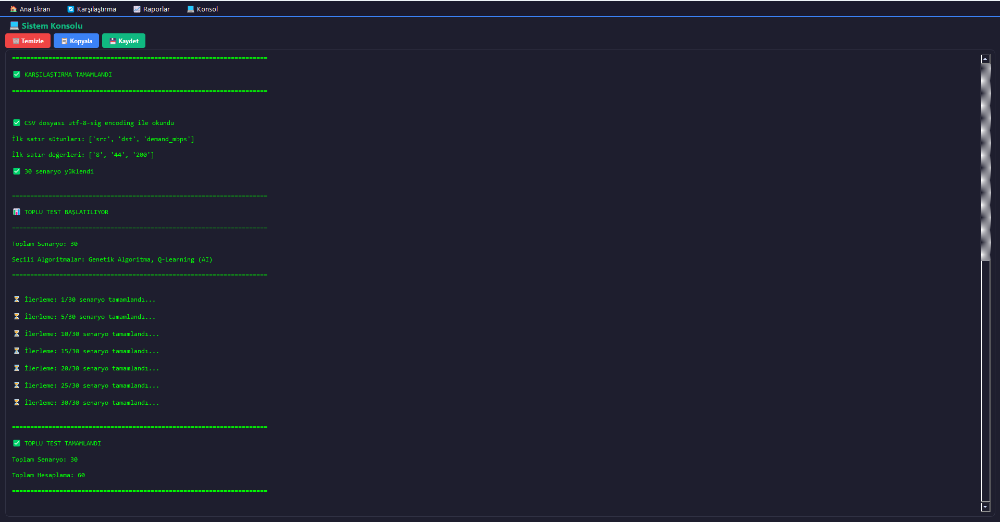

# 📡 Multi-QoS Network Routing Optimization System

> **Proje:** Bilgisayar Ağları Dönem Projesi  
> **Üniversite:** Bartın Üniversitesi  
> **Ders:**  Bilgisayar Ağları

---

## 📋 Proje Özeti

Bu proje, **çoklu QoS (Quality of Service) kısıtlı ağ rotalama optimizasyonu** problemini ele almaktadır. Kullanıcı dostu PyQt5 arayüzü ile 4 farklı optimizasyon algoritmasını karşılaştırmalı olarak test edebilirsiniz.

### 🎯 Temel Özellikler

- **Trade-off Mekanizması**: Fiber (hızlı-riskli), Microwave (dengeli), Satellite (yavaş-güvenli) link tipleri
- **3 QoS Kriteri**: Gecikme (Delay), Güvenilirlik (Reliability), Kaynak Kullanımı (Resource)
- **4 Algoritma Desteği**: 
  - Q-Learning (Pekiştirmeli Öğrenme)
  - PSO (Parçacık Sürü Optimizasyonu)
  - Genetik Algoritma (Evrimsel Hesaplama)
  - Benzetimli Tavlama (Simulated Annealing)
- **Karşılaştırma Modu**: Aynı ağ üzerinde farklı algoritmaları yan yana test etme
- **Görselleştirme**: Gerçek zamanlı ağ grafiği ve rota çizimi
- **Raporlama**: PDF ve TXT formatında detaylı metrik raporları

---

## 🖥️ Ekran Görüntüleri

### Ana Ekran (Tek Algoritma Modu)


### Karşılaştırma Ekranı (Multi-Algoritma)


### Raporlar Ekranı




### Konsol Ekranı


---

## 🚀 Kurulum ve Çalıştırma

### Gereksinimler

- **Python 3.8+** (Önerilen: Python 3.10)
- **İşletim Sistemi**: Windows 10/11, Linux, macOS

### 1. Depoyu Klonlayın

```bash
git clone https://github.com/enginteksut/Computer-Networks---Routing-Project.git
cd network-qos-routing
```

### 2. Sanal Ortam Oluşturun (Önerilen)

**Windows:**
```bash
python -m venv venv
venv\Scripts\activate
```

**Linux/macOS:**
```bash
python3 -m venv venv
source venv/bin/activate
```

### 3. Gereksinimleri Yükleyin

```bash
pip install -r requirements.txt
```

**requirements.txt** içeriği:
```
PyQt5==5.15.9
networkx==3.1
matplotlib==3.7.2
numpy==1.24.3
pandas==2.0.3
```

### 4. Uygulamayı Başlatın

```bash
python main.py
```

---

## 🎮 Kullanım Kılavuzu

### Ana Ekran (Tek Algoritma Modu)

1. **Ağ Oluşturma:**
   - Düğüm sayısını ayarlayın (varsayılan 250)
   - "Ağ Oluştur" butonuna tıklayın
   - Alternatif: "CSV'den Yükle" ile özel ağ yükleyin

2. **Kaynak-Hedef Seçimi:**
   - Grafikte düğümlere tıklayarak kaynak ve hedef seçin
   - Veya manuel olarak ID'leri girin

3. **Algoritma Parametreleri:**
   - "Diğer Özellikler ⚙️" butonuyla algoritma parametrelerini düzenleyin
   - Q-Learning: alpha, gamma, epsilon, episodes
   - PSO: swarm_size, iterations, w, c1, c2
   - GA: population, generations, crossover_rate, mutation_rate
   - SA: initial_temp, cooling_rate, iterations

4. **QoS Ağırlıkları:**
   - Kaydırıcılarla gecikme, güvenilirlik ve kaynak ağırlıklarını ayarlayın
   - Toplamın 1.0 olması otomatik normalize edilir

5. **Hesaplama:**
   - "Hesapla ve Çiz" butonuyla rotayı bulun
   - Sonuçlar sağ panelde görüntülenir

### 🎲 Seed Mekanizması (Tekrarlanabilir Testler)

**Ağ Topolojisi Seed'i**, aynı ağ yapısını tekrar tekrar oluşturmanıza olanak tanır:

1. **Seed Değeri Girme:**
   - Ana ekranda "🎲 Ağ Topoloji Seed'i" kartında seed değerini girin (0-9999)
   - Varsayılan seed: **42**

2. **Ağ Oluşturma:**
   - "🔄 Ağ Oluştur (Seed ile)" butonuna tıklayın
   - Aynı seed değeri her zaman **aynı ağ topolojisini** üretir

3. **Test Senaryoları:**
   ```
   Seed: 42  → Ağ A (250 düğüm, ~2450 kenar)
   Seed: 123 → Ağ B (250 düğüm, ~2480 kenar)
   Seed: 42  → Ağ A (tekrar - özdeş yapı)
   ```

4. **Algoritma Karşılaştırması:**
   - **Aynı seed** ile 5 farklı algoritma çalıştırın
   - Sonuçlar **karşılaştırılabilir** olur (aynı ağ yapısı)
   - Farklı QoS ağırlıkları ile testler yapılabilir

**Örnek Kullanım:**
```python
# topology.py içinde
tm = TopologyManager()
G1, pos1 = tm.create_network(seed=42)  # Ağ A
G2, pos2 = tm.create_network(seed=42)  # Ağ A (özdeş)
G3, pos3 = tm.create_network(seed=99)  # Ağ B (farklı)
```

**Avantajlar:**
- ✅ Aynı ağ üzerinde 5 algoritmanın adil karşılaştırması
- ✅ Test sonuçlarının tekrarlanabilirliği
- ✅ Hata ayıklama ve debugging kolaylığı
- ✅ Rapor ve sunum için tutarlı veriler

### Karşılaştırma Ekranı

1. Karşılaştırmak istediğiniz algoritmaları seçin (checkbox)
2. Her algoritma için ⚙️ butonuyla parametreleri düzenleyin
3. "Tümünü Hesapla" ile tüm algoritmaları çalıştırın
4. Sonuçları tablo formatında görün ve karşılaştırın

### Raporlar Ekranı

- **PDF Raporu**: Detaylı metrikler, grafik ve açıklamalar
- **TXT Raporu**: Ham veri formatında raporlar
- Son 10 hesaplama geçmişini görüntüleme

---

## 📊 Algoritma Parametreleri

### Q-Learning
| Parametre | Varsayılan | Açıklama |
|-----------|------------|----------|
| alpha     | 0.1        | Öğrenme hızı (0-1) |
| gamma     | 0.9        | İndirim faktörü (0-1) |
| epsilon   | 0.9        | Keşif oranı (0-1) |
| episodes  | 500        | Eğitim episode sayısı |

### PSO
| Parametre     | Varsayılan | Açıklama |
|---------------|------------|----------|
| swarm_size    | 30         | Parçacık sayısı |
| iterations    | 100        | İterasyon sayısı |
| w (inertia)   | 0.7        | Atalet ağırlığı |
| c1 (cognitive)| 1.5        | Bilişsel katsayı |
| c2 (social)   | 2.0        | Sosyal katsayı |

### Genetik Algoritma
| Parametre        | Varsayılan | Açıklama |
|------------------|------------|----------|
| population       | 50         | Popülasyon boyutu |
| generations      | 200        | Jenerasyon sayısı |
| crossover_rate   | 0.8        | Çaprazlama olasılığı |
| mutation_rate    | 0.08       | Mutasyon olasılığı |

### Benzetimli Tavlama
| Parametre      | Varsayılan | Açıklama |
|----------------|------------|----------|
| initial_temp   | 10000      | Başlangıç sıcaklığı |
| cooling_rate   | 0.995      | Soğutma oranı |
| iterations     | 1000       | İterasyon sayısı |

---

## 🌐 Ağ Yapısı ve Trade-off Mekanizması

### Link Tipleri

Ağ, üç farklı link tipiyle **trade-off** özelliğine sahiptir:

| Link Tipi | Bant Genişliği | Gecikme | Güvenilirlik | Kullanım Senaryosu |
|-----------|----------------|---------|--------------|---------------------|
| **Fiber** | 800-1000 Mbps  | 1-5 ms  | 0.90-0.95    | Yüksek hız gerekli, risk kabul edilir |
| **Microwave** | 300-600 Mbps | 5-10 ms | 0.95-0.98    | Dengeli performans |
| **Satellite** | 10-100 Mbps | 20-50 ms | 0.99-0.9999  | Kritik güvenilirlik gerekli |

### QoS Metrikleri

1. **Gecikme (Delay)**: Link gecikmeleri + ara düğüm işlem süreleri
2. **Güvenilirlik (Reliability)**: Çarpımsal metrik (tüm bileşenlerin güvenilirliği)
3. **Kaynak Kullanımı (Resource)**: Bant genişliği ile ters orantılı maliyet

---

## 📁 Proje Yapısı

```
project/
├── main.py                      # Ana uygulama (PyQt5 arayüzü)
├── topology.py                  # Ağ topolojisi ve algoritma entegrasyonu
├── requirements.txt             # Python bağımlılıkları
├── README.md                    # Bu dosya
├── Algorithms/
│   ├── __init__.py
│   ├── qlearning_algorithm.py   # Q-Learning implementasyonu
│   ├── pso.py                   # PSO implementasyonu
│   ├── ga.py                    # Genetik Algoritma implementasyonu
│   ├── sa_algorithm.py          # Benzetimli Tavlama implementasyonu
│   ├── metrics.py               # Metrik hesaplama fonksiyonları
│   ├── network_generator.py     # Ağ oluşturma yardımcıları
│   ├── NodeData.csv             # Örnek düğüm verileri
│   ├── EdgeData.csv             # Örnek kenar verileri
│   └── DemandData.csv           # Örnek talep verileri
├── screenshots/                 # Ekran görüntüleri
│   ├── main_screen.png
│   ├── comparison_screen.png
│   └── reports_screen.png
└── reports/                     # Oluşturulan raporlar (otomatik oluşturulur)
    ├── *.pdf
    └── *.txt
```

---

## 🔬 Algoritma Performans Karşılaştırması

| Algoritma | Hız | Çözüm Kalitesi | Bellek Kullanımı | En İyi Senaryo |
|-----------|-----|----------------|------------------|----------------|
| **Q-Learning** | ⭐⭐ | ⭐⭐⭐⭐ | ⭐⭐⭐ | Dinamik ağlar, öğrenme gerekli |
| **PSO** | ⭐⭐⭐⭐ | ⭐⭐⭐⭐⭐ | ⭐⭐⭐⭐ | Global optimum aranıyor |
| **Genetik** | ⭐⭐⭐ | ⭐⭐⭐⭐ | ⭐⭐⭐ | Karmaşık kısıtlar |
| **SA** | ⭐⭐⭐ | ⭐⭐⭐⭐ | ⭐⭐⭐⭐ | Lokal minimumdan kaçış |

---

## 🛠️ Teknik Detaylar

### Kullanılan Kütüphaneler

- **PyQt5**: GUI framework
- **NetworkX**: Graf algoritmaları ve veri yapıları
- **Matplotlib**: Ağ görselleştirme
- **NumPy**: Sayısal hesaplamalar (PSO, GA)
- **Pandas**: CSV veri işleme

### Optimizasyon Yöntemi

**Weighted Sum Method** ile çoklu QoS kısıtları tek fitness fonksiyonuna dönüştürülür:

```
fitness = w_delay * Delay + w_reliability * ReliabilityCost + w_resource * ResourceCost
```

Güvenilirlik maliyeti logaritmik ölçekte hesaplanır:
```
ReliabilityCost = -ln(reliability)
```

---

## 🐛 Bilinen Sorunlar ve Çözümler

### Problem: "No module named 'PyQt5'"
**Çözüm:**
```bash
pip install PyQt5==5.15.9
```

### Problem: Ağ bağlantısız (disconnected) hatası
**Çözüm:** Düğüm sayısını artırın veya bağlantı olasılığını yükseltin (create_network içinde `p=0.04` → `p=0.06`)

### Problem: Genetik Algoritma "Başlangıç popülasyonu oluşturulamadı"
**Çözüm:** Bant genişliği talebini azaltın veya daha büyük ağ oluşturun

---

## � Seed Bilgisi ve Tekrarlanabilirlik

### Varsayılan Seed Değeri
**Seed: 42** (Uygulama başlangıcında otomatik yüklenir)

### Seed Kullanımı

Proje, **tekrarlanabilir test sonuçları** için seed mekanizması kullanır:

```python
# Aynı seed → Aynı ağ topolojisi
tm = TopologyManager()
G1, pos1 = tm.create_network(seed=42)  # Ağ yapısı A
G2, pos2 = tm.create_network(seed=42)  # Ağ yapısı A (özdeş)

# Farklı seed → Farklı ağ topolojisi
G3, pos3 = tm.create_network(seed=123) # Ağ yapısı B
```

### Test Senaryoları

Rapor için kullanılan test seed değerleri:

| Senaryo | Seed | Düğüm | Kenar | Açıklama |
|---------|------|-------|-------|----------|
| **Test 1** | 42 | 250 | ~2450 | Varsayılan test ağı |
| **Test 2** | 123 | 250 | ~2480 | Yoğun bağlantılı ağ |
| **Test 3** | 999 | 250 | ~2420 | Seyrek bağlantılı ağ |
| **Test 4** | 2025 | 250 | ~2465 | Dengeli ağ |
| **Test 5** | 1337 | 250 | ~2455 | Karışık topoloji |

### Seed ile Algoritma Karşılaştırması

**Aynı ağ üzerinde 5 algoritmanın adil karşılaştırması:**

```bash
# 1. Seed belirle (örnek: 42)
# 2. Ağ oluştur
# 3. Her algoritma ile aynı kaynak-hedef çifti test et:
   - Q-Learning (seed=42)
   - PSO (seed=42)
   - Genetik Algoritma (seed=42)
   - Benzetimli Tavlama (seed=42)
   - Dijkstra (seed=42)
```

**Sonuç:** Tüm algoritmalar **özdeş ağ yapısı** üzerinde çalıştığı için performans farkları **algoritma özelliklerinden** kaynaklanır.

---

## �📚 Kaynaklar ve Referanslar

1. **NetworkX Documentation**: https://networkx.org/documentation/stable/
2. **PyQt5 Tutorial**: https://www.riverbankcomputing.com/static/Docs/PyQt5/
3. **Q-Learning**: Sutton & Barto - Reinforcement Learning: An Introduction
4. **PSO**: Kennedy, J., & Eberhart, R. (1995). Particle swarm optimization
5. **Genetik Algoritmalar**: Goldberg, D. E. (1989). Genetic Algorithms
6. **Benzetimli Tavlama**: Kirkpatrick, S., et al. (1983). Optimization by simulated annealing

---

## 🔐 Seed Bilgisi ve Tekrarlanabilirlik

Ağ topolojisi her çalıştırmada **farklı** üretilir (`seed=None` kullanılmaktadır). Deterministik testler için:

```python
# topology.py içinde
self.G = nx.erdos_renyi_graph(n=self.num_nodes, p=0.04, seed=42)  # Sabit seed
```

**Mevcut Seed Durumu**: `seed=None` (rastgele ağ üretimi)  
**Görselleştirme Seed**: `seed=42` (spring_layout için sabit konumlar)

---


## 👥 Ekip ve Katkıda Bulunanlar (Team & Contributors)

Bu proje, Bartın Üniversitesi Bilgisayar Ağları dersi (2025-2026 Güz Dönemi) kapsamında BSM307 proje grubu tarafından geliştirilmiştir:

### 🧩 Proje Yönetimi ve Sistem Testi
* **Engin Tekşut** - Q-Learning Entegrasyonu

### 🧬 Genetik Algoritma (GA) Ekibi
* **Wahidullah Omari** - GA Kodlama ve Entegrasyon
* **Muhammad Dhafin Faza** - GA Kodlama ve Entegrasyon

### 🖥️ Arayüz ve Topoloji Modülü
* **Yusuf Meydan** - Arayüz Geliştirme & Dış Veri Entegrasyonu
* **Mustafa Kağan Eren** - Topoloji Tasarımı ve Entegrasyon

### 🐝 Parçacık Sürü Optimizasyonu (PSO) Ekibi
* **Ahmet Adnan Damar** - PSO Entegrasyonu
* **Emirhan Laleli** - PSO Entegrasyonu

### 🔥 Benzetimli Tavlama (Simulated Annealing) Ekibi
* **Jahangir Babayev** - SA Kodlama ve Entegrasyon
* **Halil Talha Bayrak** - SA Kodlama ve Entegrasyon

## 📧 İletişim (Contact)

Projeyle ilgili sorularınız için:
* **LinkedIn:** [Wahidullah Omari](https://www.linkedin.com/in/wahidullah-omari-505150259/)
* **GitHub:** [wahidullahomari](https://github.com/wahidullahomari)

---

## 📜 Lisans

Bu proje akademik amaçlı geliştirilmiştir. **Bartın Üniversitesi** Bilgisayar Ağları Dersi kapsamında kullanılmak üzere hazırlanmıştır.

## 👏 Teşekkürler

Bu projenin geliştirilmesinde katkılarından dolayı aşağıdaki kişi ve kurumlara teşekkür ederiz:

* **Dr. Öğr. Üyesi Evrim Güler** - Ders Sorumlusu ve Rehberliği için
* **Bartın Üniversitesi** - Bilgisayar Teknolojisi ve Bilişim Sistemleri
* NetworkX ve PyQt5 açık kaynak topluluğu

---

**Son Güncelleme**: 31 Aralık 2025  
**Versiyon**: 1.0.0
